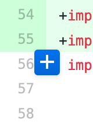
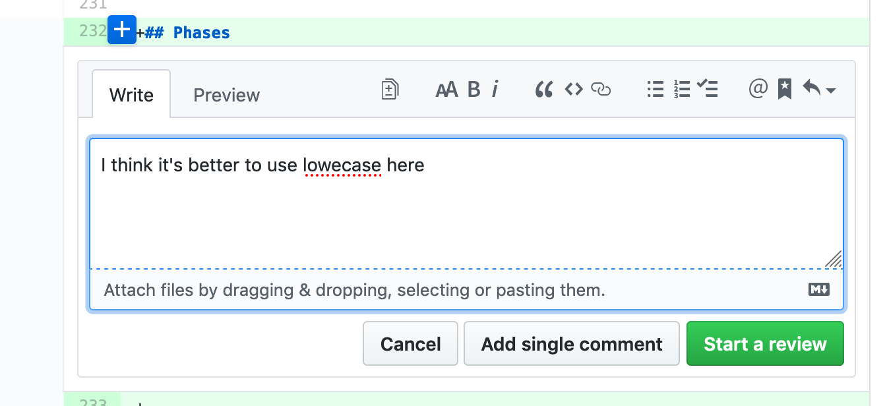
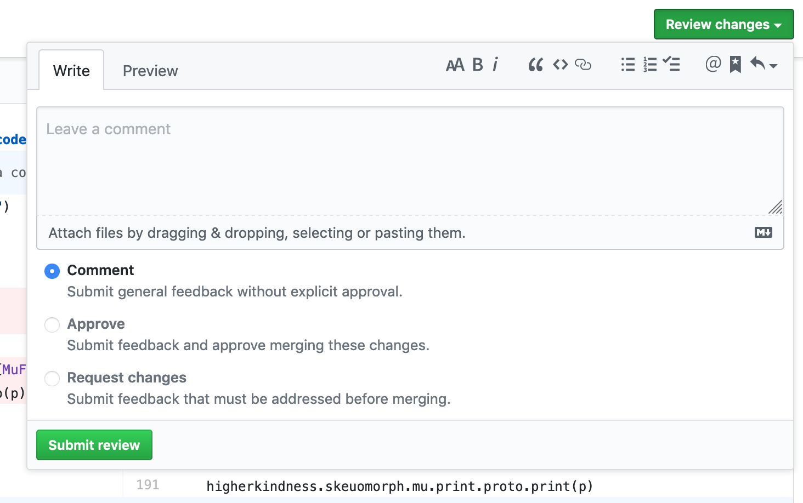

# _Syllabus_

## Catchup & new tools (2 sessions)

Today we will refresh concepts from previous courses and learn about
some new tools that will be used along this program.

## React (4 sessions)

React is currently one of the most famous JS frameworks.  We will
learn its concepts and how to structure applications with it.

## CSS limits, SASS, design systems (1 session)

We've already used CSS in the past. We'll see some of its limitations
and learn about SASS a tool for writing better CSS.

## Project show & tell (1 session)

In the last session we will introduce the project and we'll also have
time to work on it.

# Plan for today

- git
- npm
- pull requests
- reviews
- continuous integration

# Git

## 

## git

Git is a VCS that makes our lives easier when developing software.  It
allows us to:

- manage versions of the code
- collaborate with other peers in the same codebase

## 

There are several ways for interacting with git.  Using UI clients
(such as github desktop), or via the command line.

Even though it might sound scary, we'll use the command line in this
course.

## git

Git has some important concepts that we need to be used to:

- repository
- branch
- commit

## repository

A git repository is simply a folder in your computer whose contents
are tracked by git.

## branch

With branching we can diverge from the main line of code in our
repository to create a new feature or fix a bug in the code.

## commit

A git commit is each one of the changes that the developer wants to
store in the git repository.

## commit

```
commit 8a8910e9f06194fef189be3544d18ba20775bd7d
Author: Pepe García <pepe@pepegar.com>
Date:   Thu Dec 20 09:51:56 2018 +0100

    make code more readable by using contramapN (#25)
    
    we can flatten the tuples because we don't use >*< anymore but
    just (a, b, c).contramapN(whatever)
```

## commit

As you can see commits have four main components:

<p class="fragment fade-in"> **hash** </p> <p class="fragment
fade-in"> **author** </p> <p class="fragment fade-in"> **date** </p>
<p class="fragment fade-in"> **message** </p>

# Git commands

## disclaimer

In all the slides, lines starting with `$` means they were commands
executed in the console.

## creating new repositories

In git, in order to create a repository we should first navigate to
the repository folder and then execute git init:

```
$ cd test
$ git init .
Initialized empty Git repository in /Users/pepe/projects/web-development-course/test/.git/
```

## cloning existing repositories

Cloning a repository mean creating a copy of it in your local
computer.

```
$ git clone https://github.com/hakimel/reveal.js
```

## current status

`git status` is the most common git command.  It shows us a summary of
the current state of the repository.  We can see which files are new,
which files are changed...

## git status

```
$ git status
On branch master

No commits yet

Untracked files:
  (use "git add <file>..." to include in what will be committed)

	slides.html
	slides.md

nothing added to commit but untracked files present (use "git add" to track)
```

## add files

we need to tell git which files we want to commit by `adding` them to
the stage.

## add files

```
$ git add file1 file2 file3
```

or

```
$ git add file1
$ git add file2
$ git add file3
```

## commit

`git commit` creates a new commit with the given message, for all the
files previously added.

```
$ git commit -m "this is my message"
```

## branches

As we saw before, branches allow us to parallelize the work on a
repository.  Imagine that I want to work in a change for my project,
change the color for all the buttons.

I can create a new branch in order to work on that without bothering
all my peers.

## branches


## branches

we create new branches with the `git checkout -b` command.

```
$ git checkout -b branch-name
```

Using this command will create a new branch called branch-name
starting from the current branch, and move us to it

## remotes

When we work with git, we normally have a local copy of the
repository, and another copy of that repository in a git web service
(like Github).

## remotes

We can make our local repository point to a remote repository with the
command `git remote add`.

```
$ git remote add origin https://github.com/pepegar/test-repository
```

This command will make my local copy point to the repository in
`https://github.com/pepegar/test-repository`.

## push

We use push to send all our new commits to another repository.

## push

The first argument we pass to `git push` is the name of the remote
repository, and the second one, the name of the branch.

## push

```
$ git push origin master
```

## pull

`git pull` does the inverse of `push`, updates the local repository
with the commits of the `branch` in the `remote` repository.

## pull

```
$ git pull origin master
```

## git exercise

1. create a local folder, navigate to it, and create a repository
2. create a new file inside that folder. Call it `README.md`
3. add the following content to that file:
```
# this is done with console git!
```
4. commit that file
5. create a new repository in github. call it `test-console-git`
6. push your code to the remote repository

# Javascript

In the previous course we used JS and run it in the browser.  That's
not the only way we have for running Javascript.  There's another
famous package for running JS in the server called NodeJS.

# npm

## npm

NPM is the task runner for NodeJS.  What's a task runner? a piece of
software with which we can automate tasks and run it whenever we want.

There are a million different uses for JS task runners, but some of
them are:

- running unit tests
- running linters
- minifying
- transpilation

## npm

Along this course we will see more uses for NPM but for now we'll see
some simple examples.

## npm tasks

npm tasks are declared in a `package.json` file, in the `scripts`
section.  They can be run with `npm run taskName`.

## example 1

# software lifecycle

## Pull requests

Pull requests are the mechanism used in github to get a branch merged
into another branch.

## exercise

1. Fork the `test-console-repository` repository in github from any of
   your classmates.
2. Add some changes to the readme.
3. Push the changes to your fork.
4. Create a pull request to your classmate's repository.

(if you receive a pull request in your repo, do not merge yet.)

## code reviews

Code reviews are a vital part in the software development cycle.  With
code reviews we validate that the code we're accepting in our project
via a pull request is up to its standards.

## code reviews

In order to perform a code review we should go to the files changed
part of the pull request:


## code reviews

Code reviews are formed by comments.  We add comment by passing the
cursor over the line number on the changes.



## code reviews

Then we add a meaningful comment.



## code reviews

And finally we submit the review.



## exercise. Performing a code review.

## Continuous integration


